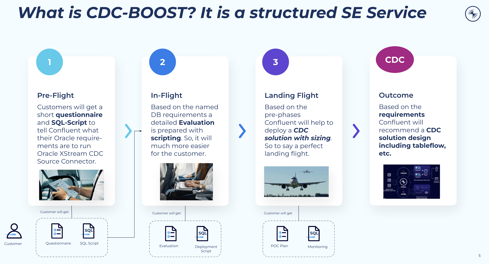

# ATG CDC Boost-Service ✈️

CDC Boost-Service helps customers deploy the **Confluent Oracle XStream CDC Source Connector** faster, safer, and with best practices built in. 
Confluent offers a [self-managed](https://docs.confluent.io/kafka-connectors/oracle-xstream-cdc-source/current/overview.html) XStream Connector running in on-prem environments and a [fully-managed](https://docs.confluent.io/cloud/current/connectors/cc-oracle-xstream-cdc-source/cc-oracle-xstream-cdc-source.html) one running in Confluent Cloud. 
The ATG CDC Boost-Service provides a guided "flight journey" in three phases — **Pre-Flight**, **In-Flight**, and **Landing Flight** — ensuring that your CDC solution is designed and deployed based on your exact Oracle requirements.

## ✨ Why CDC Boost-Service?
Deploying the Oracle XStream CDC Source Connector can be complex.  
Every Oracle environment is different — from version compatibility to database privileges and table-level design.  

CDC Boost-Service reduces this complexity by:
- Collecting requirements upfront
- Automating evaluation with SQL scripting
- Providing a recommended CDC solution design (tables, flows, DB changes, sizing)

## 🛫 The Flight Journey

The journey is prepared and ready to execute:

### 1. Pre-Flight
Customers answer a [**short questionnaire**](pre-flight/Confluent-Oracle-XStream-CDC-Connector-status-check-questionnaire-v.1.2.pdf) and run a [**SQL script**](pre-flight/Confluent_CDCXStream_info_gathering.sql).  
This gives Confluent the details needed about the Oracle environment (e.g., DB version, privileges, redo log setup, replication capabilities).

**Outcome:** Clear overview of your Oracle requirements. Kindly forward your responses to your account team.

### 2. In-Flight
Confluent prepares a [**detailed evaluation**](in-flight/Confluent-Oracle-XStream-CDC-Connector-status-check-questionnaire-evaluation%20sheet-v.1.2.pdf) based on the Pre-Flight data.  
This includes:
- Scripting for environment checks for [NON-CDB](in-flight/non-cdb-deployment.sql) and [CDB](in-flight/cdb-deployment.sql) environment
- Compatibility validation
- Identifying required configuration changes, like this [sample](in-flight/01_setup_database.sql).

**Outcome:** A ready-to-use evaluation package that simplifies the customer’s preparation.

### 3. Landing Flight
With all requirements known, Confluent provides **deployment guidance** for the Oracle XStream CDC Source Connector:
- CDC solution design
- Structure redesign with SMT, or capturing changes from the beginning, or Transation via Flink SQL etc.
- Table flow recommendations if required
- Sizing and resource planning
- Database change requirements
- Monitoring recommendations and scripts
- A prepared very common POC Plan, with Step-by-Step Guide for very common test customers did so far.

**Outcome:** A smooth “landing” with a tailored CDC solution aligned to customer needs.

## 📦 Outcome
At the end of the journey, the customer receives:
- A **Confluent-recommended CDC solution design**
- Detailed insights into the setup and maybe some recommaned DB changes
- Deployment steps aligned with best practices

---

## 🚀 Getting Started

Connect with your Account Executive from Confluent. This service is free of charge and Confluent will help very fast to identity a working solution for you.

### Prerequisites for XStream
- Access to Oracle Enterprise Edition DB
- Confluent Platform / Confluent Cloud
- Permissions to run SQL scripts against the Oracle database
